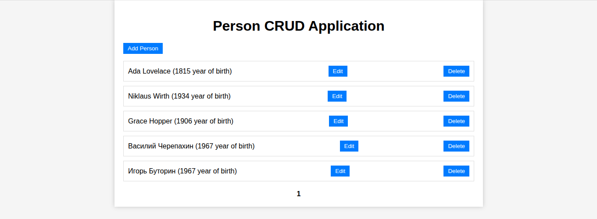

# JBang простое CRUD приложение с Spring Boot, Vue 

[О Jbang](https://v.perm.ru/index.php/component/content/article/jbang?catid=15)

Это весь проект - 2 файла index-fetch.html + springbootJpaVue.java. Тем не менее это действительно CRUD приложение.

main,  RestController, JpaRepository - __ВСЕ Spring beans__ в __ОДНОМ__ файле springbootJpaVue.java.
HTML страница только одна index-fetch.html.

Запуск:

````shell
jbang -Dspring.datasource.url=jdbc:h2:mem:person-db  springbootJpaVue.java
````




Ссылки:

[https://v.perm.ru/index.php/component/content/article/jbang?catid=15](https://v.perm.ru/index.php/component/content/article/jbang?catid=15)
